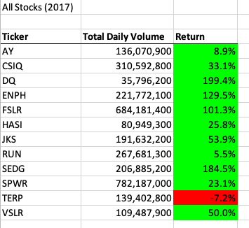
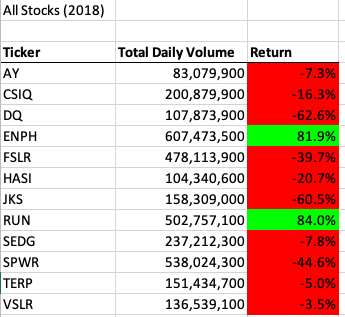
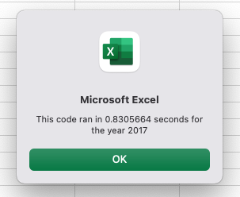
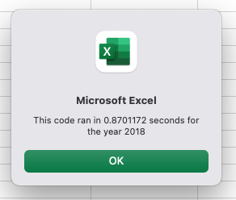
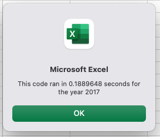
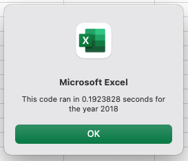

# Stock Analysis With Excel VBA

## Overview of Project
### Purpose
Our client Steve wanted to analyze the stock market over the last years. He wanted to have an Excel file with macros that can collect certain stock information and determine whether or not the stocks are worth investing in. The workbook with VBA code was prepared for him so he can analyze an entire stock market dataset. The last part of the Project was code refactoring. The goal was to increase the efficiency of the original VBA code. The original code was edited to loop through all the data one time in order to collect the same information.

## Results

The original VBA code included two loops:
```
 '4) Loop through tickers
   For i = 0 To 11
       ticker = tickers(i)
       totalVolume = 0
       '5) loop through rows in the data
       Worksheets(yearValue).Activate
       For j = 2 To RowCount
           '5a) Get total volume for current ticker
           If Cells(j, 1).Value = ticker Then

               totalVolume = totalVolume + Cells(j, 8).Value

           End If
           '5b) get starting price for current ticker
           If Cells(j - 1, 1).Value <> ticker And Cells(j, 1).Value = ticker Then

               startingPrice = Cells(j, 6).Value

           End If

           '5c) get ending price for current ticker
           If Cells(j + 1, 1).Value <> ticker And Cells(j, 1).Value = ticker Then

               endingPrice = Cells(j, 6).Value

           End If
       Next j
       '6) Output data for current ticker
       Worksheets("All Stocks Analysis").Activate
       Cells(4 + i, 1).Value = ticker
       Cells(4 + i, 2).Value = totalVolume
       Cells(4 + i, 3).Value = endingPrice / startingPrice - 1
   Next i

```

The refactored VBA code included just one loop:

```
 
    '1a) Create a ticker Index
    tickerIndex = 0
    
    '1b) Create three output arrays
    Dim tickerVolumes(12) As Long
    Dim tickerStartingPrices(12) As Single
    Dim tickerEndingPrices(12) As Single
    
    ''2a) Create a for loop to initialize the tickerVolumes to zero.
    Worksheets(yearValue).Activate
    For i = 0 To 11
        tickerVolumes(i) = 0
        tickerStartingPrices(i) = 0
        tickerEndingPrices(i) = 0
    Next i
  
        
    ''2b) Loop over all the rows in the spreadsheet.
    For i = 2 To RowCount

        '3a) Increase volume for current ticker
    tickerVolumes(tickerIndex) = tickerVolumes(tickerIndex) + Cells(i, 8).Value
        
        '3b) Check if the current row is the first row with the selected tickerIndex.
        'If  Then
        If Cells(i, 1).Value = tickers(tickerIndex) And Cells(i - 1, 1).Value <> tickers(tickerIndex) Then
            tickerStartingPrices(tickerIndex) = Cells(i, 6).Value
        'End If
        End If
      
        '3c) check if the current row is the last row with the selected ticker
         'If the next row’s ticker doesn’t match, increase the tickerIndex.
        'If  Then
         If Cells(i, 1).Value = tickers(tickerIndex) And Cells(i + 1, 1).Value <> tickers(tickerIndex) Then
            tickerEndingPrices(tickerIndex) = Cells(i, 6).Value
         End If

        '3d Increase the tickerIndex.
        If Cells(i, 1).Value = tickers(tickerIndex) And Cells(i + 1, 1).Value <> tickers(tickerIndex) Then
                tickerIndex = tickerIndex + 1
        'End If
        End If
    
   Next i
    
    '4) Loop through your arrays to output the Ticker, Total Daily Volume, and Return.
    For i = 0 To 11
        
        Worksheets("All Stocks Analysis").Activate
        Cells(4 + i, 1).Value = tickers(i)
        Cells(4 + i, 2).Value = tickerVolumes(i)
        Cells(4 + i, 3).Value = tickerEndingPrices(i) / tickerStartingPrices(i) - 1
        
    Next i
```





When the original code was executed, it ran in 0.83 seconds for the 2017 and 0,87 seconds for the 2018.



When the refactored code was executed, it ran in 0.19 seconds for the 2017 and 0,19 seconds for the 2018 which is much faster than the original code.



## Summary
### Advantages of Refactoring Code
- Refactoring code helps to make the code more organized and easier to read and understand.
- Refactoring code can increase speed of running program.
### Disadvantages of Refactoring Code
- We need an additional amount of time to make a refactoring code.
- Refactoring code could generate bugs that could make additional risk for the Project 

### Pros to Refactoring the Original VBA Script
- Improving the efficiency of the program.
- Improving programming skills such as working with loops

### Cons to Refactoring the Original VBA Script
It took some time to get the concept of using one loop.


